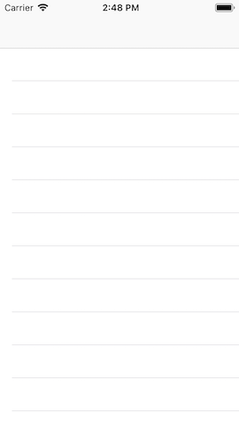
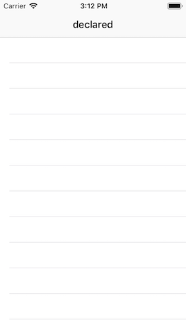
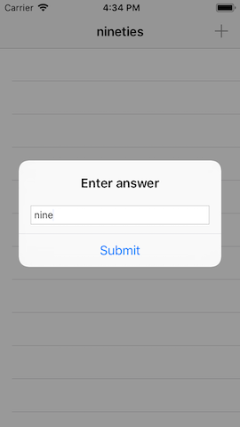

# Easy Browser

## Description
An anagram game that uses closures and booleans

## Demo
### features/setting-up
| Screenshot 01 |
| ------------- |
|  |

### features/read-from-disk
| Screenshot 02 |
| ------------- |
|  |

### features/pick-a-word-any-word
| Screenshot 03 |
| ------------- |
|  |